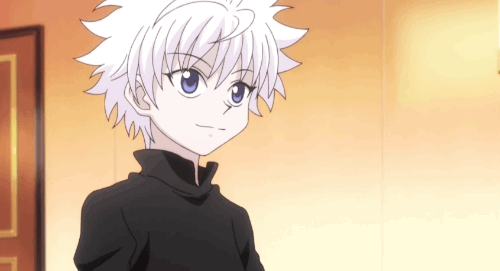

  

<h2 align=center>» I'm a Studying Data Science and Computer Science «</h2> 

↱ 🕵️ Always studying and learning new things,  
↱ 📠Lately studying python, java and javascript,  
↱ 🈠Never despair for a dream you can achieve soon. 

 

#

<h3 align=center>» ⌜My skills⌟ «</h3>

 

  

#
<h3 align=center> » ⌜Socials⌟ «</h3> 

   

###

  
  

#

<picture align="center">
 <source media="(prefers-color-scheme: dark)" srcset="https://raw.githubusercontent.com/LucasOMestredosmagos/LucasOMestredosmagos/output/snake.svg">
 <source media="(prefers-color-scheme: light)" srcset="https://raw.githubusercontent.com/LucasOMestredosmagos/LucasOMestredosmagos/output/snake.svg">
 
</picture> 
  